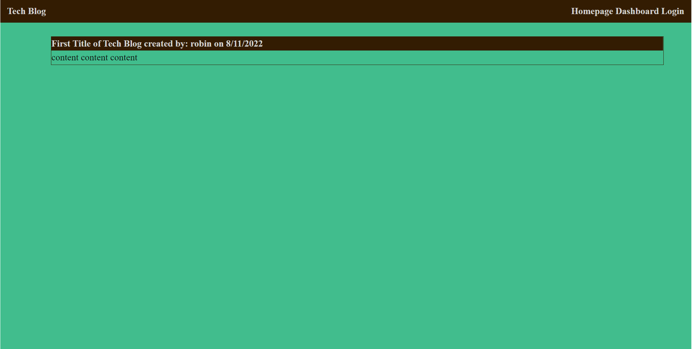

# Tech Blog

## Description

Tech Blog is a full stack application which lets the user create a username to signup, login/logout, then create blog posts which will be saved.

## Table of Content

- [Description](#description)
- [Installation](#installation)
- [Usage](#usage)
- [Questions](#questions)

## Installation

1. Download the repository tech-blog from bin-ostrowski's GitHub.
2. Open the project in VS, then open a terminal from the server.js file in root directoy.
3. Enter the command "mysql -u root -p", next enter password for MySQl.
4. Connect the database with command "source db/schema.sql". Now Quit mysql on the command line.
5. Run the command "npm start" to run the server.
6. Open web browswer to: http://localhost:3001

## Usage

Test out the app here:
https://murmuring-headland-96223.herokuapp.com/

## Screenshot

## Questions

GitHub: [Bin-Ostrowski](https://github.com/Bin-Ostrowski)

Email: bin.ostrowski@gmail.com

Please send any additional questions to the email listed above.
